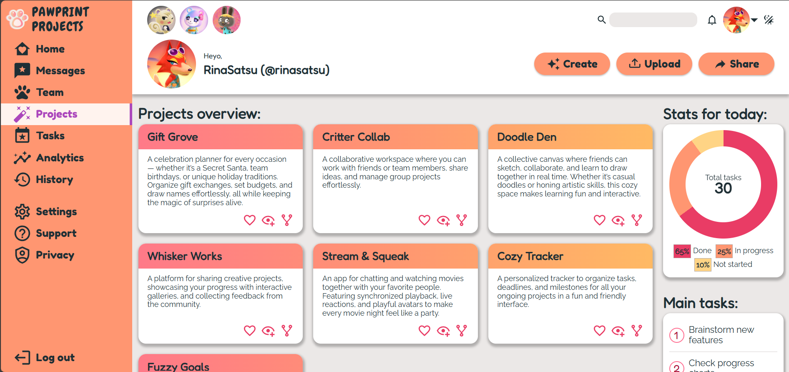

# Dashboard Project
This project is a mock-up for a web-based dashboard designed to display and manage projects effectively. It focuses on providing a responsive, user-friendly interface while showcasing modern front-end development practices.

## Purpose of the Project
The Dashboard Project was created to:

* Practice building responsive layouts using CSS Grid and Flexbox.
* Explore techniques to enhance accessibility and user experience.
* Develop a visually appealing interface with modern design principles.

### Technologies Used

**HTML:** Structured content for the dashboard layout.

**CSS (Grid & Flexbox):** For creating a responsive and visually appealing design.

**JavaScript:** Enhances interactivity and provides dynamic theme change.

## Key Features

**Responsive Layout:** Adapts seamlessly to different screen sizes and devices.

**Dark Theme:** Offers a visually comfortable experience for low-light environments.

**Interactive Charts:** Includes a doughnut chart.

**Hover Effects:** Engaging hover animations for better interactivity.

**Accessibility Enhancements:** Improved navigation and readability for all users.

**Cross-Browser Compatibility:** Optimized for modern browsers.

### Accessibility Features
* ARIA attributes for better screen reader support.
* High contrast ratios for improved visibility.
* Keyboard navigation support and focus effects for ease of use.

## How to Use
1. Visit the website where the Dashboard Project is hosted OR Clone or download the repository and open the HTML file in your browser.
2. Explore the dashboard features, including project listings, themes, and interactive charts.

## Disclaimer
This project is for demonstration purposes and does not include backend functionality. All data is static and intended to illustrate the design and layout of a project dashboard.

## Feedback and Issues
If you encounter any issues with this Dashboard Project or have suggestions for improvements, please open an issue on the GitHub repository. Your feedback is valuable and will help make this project even better.

### Known Issues
**Chart Rendering in Older Browsers:** The doughnut chart may not render properly in some older browsers. If this occurs, a fallback bar chart will be displayed to ensure functionality.

## Credits
This project was created with passion by Maryna Snihurska (aka RinaSatsu). Special thanks to The Odin Project for their idea of this project.

Feel free to explore, adapt, and build upon this project to meet your needs!
